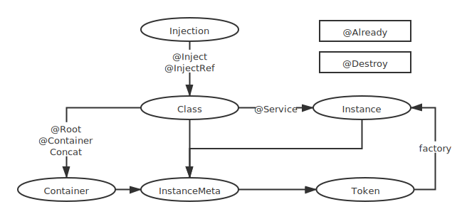

## 安装
```
$ npm install git+https://github.com/gityoog/ioc-di.git --save
```

## 使用
 - 使用 `@Root()` 装饰器为当前类添加一个顶层容器 会依次初始化所有可注入类和子容器
 - 使用 `@Service()` 装饰器标记当前类为可注入类
 - 使用 `@Inject()` 装饰器注入类
 - 当类循环引用时请使用 `@InjectRef(() => token)` 注入
 - 在 `tsconfig.json` 中设置 `emitDecoratorMetadata: true` 可使用属性类型作为默认注入令牌
 - 初始化容器和注入信息是发生在构造函数之后 所以当需要第一时间访问注入属性的时 请使用 `@Already` 装饰器
 - 当可注入类实例为手动初始化时 可使用 `Concat` 函数使目标实例使用当前实例的容器
 - 使用 `@Container()` 可使当前类使用一个独立的子容器
 - `@Destroy` 使当前函数为销毁函数 调用此函数会使挂载在当前实例的容器销毁 并销毁其创建的其他实例
```ts
// file entry.ts

@Root()
@Service()
class Entry {
  @Inject() service!: Service
}

// file service.ts

@Service()
class Service {
  @Inject(Foo) foo!: Foo
  @Inject() foo2!: Foo2

  constructor(){
    this.foo.method() // ❌无法在构造函数内访问注入属性
    this.init() //✔️使用 @Already 装饰器可以在对应函数内第一时间访问注入属性
  }

  method() {
    this.foo.method()
    this.foo2.method()

    foo3 = Concat(this, new Foo3)
  }

  @Already
  init(){
    this.foo.method()
    this.foo2.method()
  }
}

// file foo.ts

@Service()
class Foo {
  @InjectRef(() => Foo2) foo2!: Foo2
  
  method() {
    console.log(this.foo2)
  }
}

// file foo2.ts

@Service()
class Foo2 {
  @InjectRef(() => Foo) foo!: Foo

  method() {
    console.log(this.foo)
  }
}

// file foo3.ts 

@Container()
@Service()
class Foo3 {

}
```

## 运行流程
 